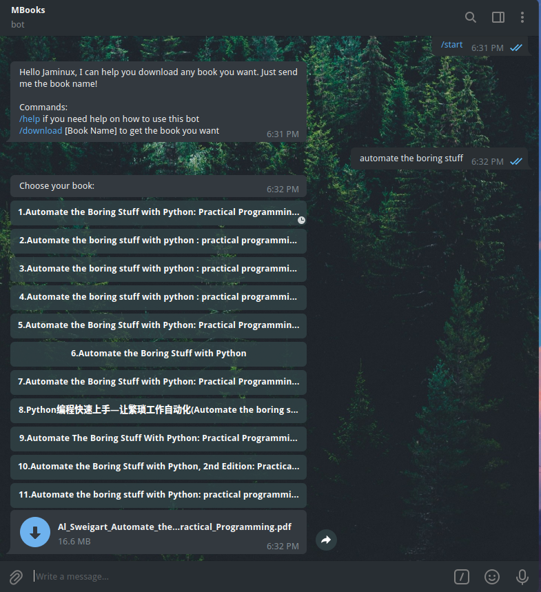

# Book Downloder Bot
<p align="center">
A bot that provides download links for any book you'd like. 
<p align="center">

## Usage
1. Send the book name to the bot.
2. Bot will send you options matching the book name. Click on your book.
3. Bot will send you a pdf file of the book!



## Getting Started
Get your own Telegram token from BotFather. More on that [here](https://core.telegram.org/bots). Then, create an environment variable named TG_API_KEY or just replace API_KEY at the top of main.py

1. Clone this repo and run:
```sh
pip install -r requirements.txt
```

2. Run the bot:
```sh
python main.py
```
